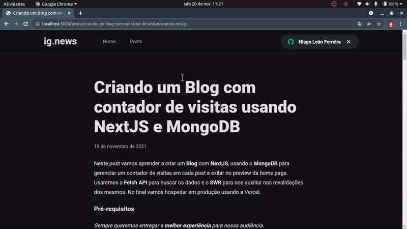

# IgNews
- Este projeto foi desenvolvido durante a trilha React do treinamento Ignite da Rocketseat
- Aqui utilizamos o NextJs para criar um Blog em que as publicações podem ser vistas a partir de assinaturas mensais
- As tecnologias aqui utilizadas são
  - NextJs - Desenvolvimento da aplicaçã
  - Stripe - Pagamentos de assisnaturas
  - FaunaDB - Banco de dados para armazenamentos de usuários e assinaturas
  - Prismic - Gerenciamento dos post para o blog

# Preview



# Lições importantes

- Pasta pages deve estar ou no root ou dentro de src
  - Dentro de pages vão ter as rotas e por isso não mude de lugar
- Sistema de rotas do Next.js
  - File System Route
- Para adicionar typescript no projeto basta criar arquivos javascript

  - Ele detecta automaticamente quando roda o server
  - Não esquecer de instalar as tipagens e o typescript

- Para estilização

  - Devemos criar aquivos .module.css para que o css fique de forma scoped
  - Não se deve estilizar componentes diretamente. Tem que ser dentro de uma classe ou id

- Se a renderização for a nível do componente, a renderização ocorrerá no browser e não no server.

- Para arquivos no Next
  - Se o arquivo começa com _ ele não é tratado com rota.
    - Por exemplo _lib

# Comandos úteis

```bash
# Fazer com que o stripe fique monitorando eventos e redirecione para uma url da sua api
stripe listen --forward-to localhost:3000/api/webhooks
```
